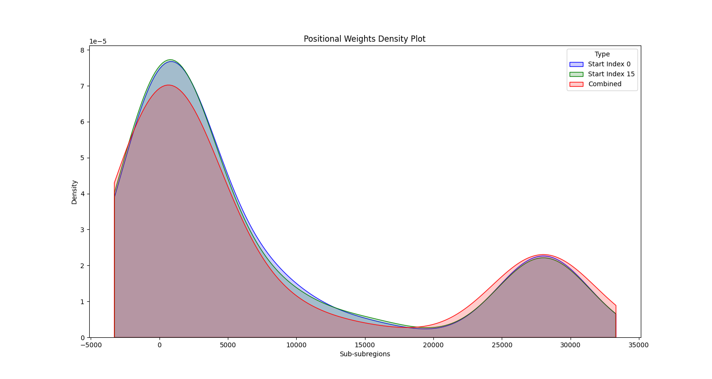
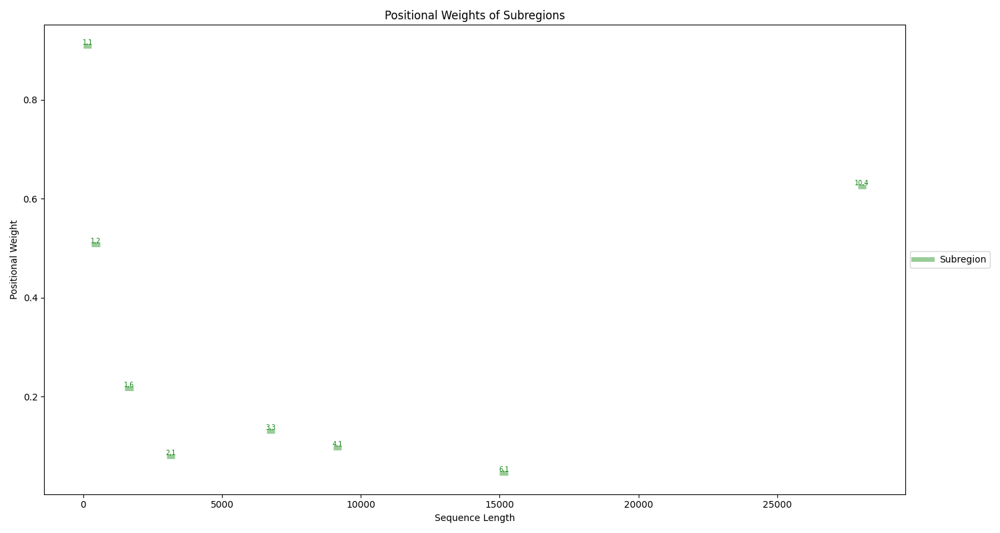
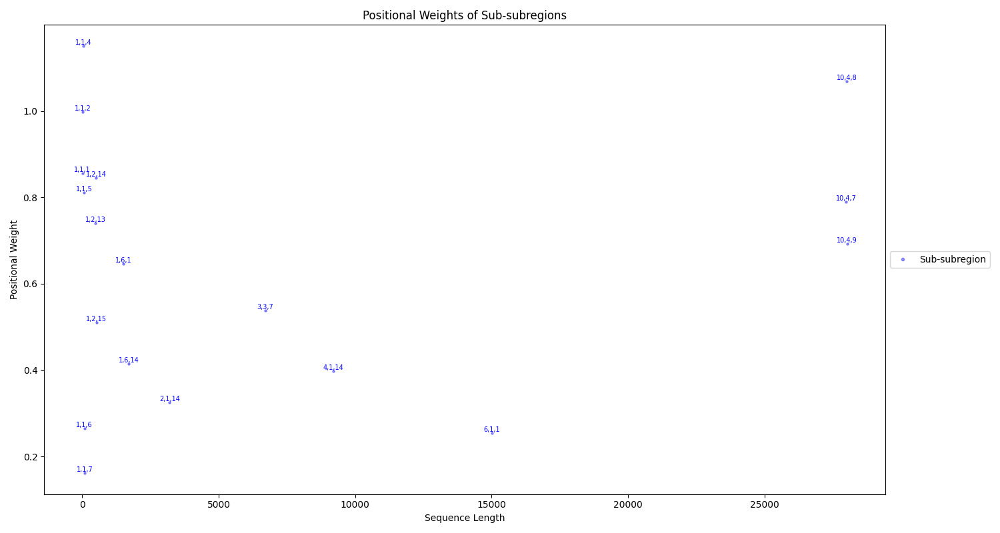

# ECMPIA: Encoding and Clustering Mutations Positional Impact Algorithm

The ECMPIA algorithm integrates partitioning and clustering methods to capture and analyze the positional impact of mutations (bases and regions) across DNA/RNA/protein sequences. It is designed to help researchers assess the impact of highly mutated bases and regions based on their positions and uncover the relationships between their positional impacts.

## Project Description

The ECMPIA repository serves as a toolkit for researchers to implement the ECMPIA algorithm for analyzing mutation positional impacts.

## Directory Structure

- `src`: Contains source code files.
- `mutations_data.csv`: Sample CSV file with mutation data.

## mutations_data.csv

This file contains sample mutation data with the following columns:
- `mut_positions` (integer): Mutation positions in the sequence.
- `impact_score` (Positive float or integer): Impact score or Shannon entropy associated with mutations.

Replace the data in this file with your own mutation data before running the analysis.

## ECMPIA_result

This directory contains the output results from the algorithm. The following files are generated:
- `positional_weights_0.csv`: Mapped mutations and calculated positional weights for sub-subregions partitioned starting at index 0.
- `positional_weights_15.csv`: Mapped mutations and calculated positional weights for sub-subregions partitioned starting at index 15.
- `combined_data.csv`: Combined data from both sets of partitioned sub-subregions.
- `region_details.csv`: Detailed information about regions, subregions, and sub-subregions.
- `region_weights.csv`: Range and weight for each region.

## Plots

### Density, Scatter, and Bar Plots

1. **Density Plot of Positional Weights**
   - Description: This plot shows the density of positional weights across sub-subregions partitioned starting at index 0, index 15, and the combined data.
   - 

2. **Scatter Plot of Positional Weights by Mutation Positions**
   - Description: This plot shows the positional weights by mutation positions for sub-subregions partitioned starting at index 0, index 15, and the combined data.
   - 

3. **Bar Plot of Positional Weights Across Regions, Subregions, and Sub-subregions**
   - Description: This plot shows the positional weights across regions, subregions, and sub-subregions, with interval bars indicating the range and weight for each category.
   - 

4. **Scatter Plot of Positional Weights Across Regions and Subregions**
   - Description: This plot shows the positional weights across regions and subregions, indicating the positional weights for each category.
   - 

5. **Scatter Plot of Positional Weights of Regions**
   - Description: This plot shows the positional weights of different regions in the sequence.
   - 

6. **Scatter Plot of Positional Weights of Subregions**
   - Description: This plot shows the positional weights of different subregions in the sequence.
   - 

7. **Scatter Plot of Positional Weights of Sub-subregions**
   - Description: This plot shows the positional weights of different sub-subregions in the sequence.
   - 

**Note:** The labels for plots 3, 4, 5, 6, and 7 are numbers representing regions, subregions, and sub-subregions. The format for these labels is "region, subregion" for subregions and "region, subregion, sub-subregion" for sub-subregions. Users can associate these numbers with their respective ranges across the sequence using the information provided in the `region_details.csv` file.

## System Requirements

- macOS 10.15 or higher / Windows 10 or higher / Linux
- Python 3.9 or higher
- pip3 24
- *May work with similar versions.

## Installation Instructions

1. Clone the repository:
   ```bash
   git clone https://github.com/raeufroushangar/ECMPIA.git
   cd ECMPIA


2. Create a virtual environment inside the ECMPIA directory:
   ```bash
   python3 -m venv venv

3. Activate the virtual environment:

- On macOS and Linux:
   ```bash
   venv/bin/activate
- On Windows:
   ```bash
   .\venv\Scripts\activate

4. Install required packages:
   ```bash
   pip install -r requirements.txt

5. Run Analysis Script:
   ```bash
   python3 ecmpia_main.py -f <mutation_file_path> -r <result_dir_path> -l <sequence_length>

   Replace: 
   - <mutation_file_path> path to your mutations_data.csv file
   - <result_dir_path> path of directory where you want to store the results
   - <sequence_length> length of your sequence
   
   For example:
   python3 -B ecmpia_main.py -f /mutations_data.csv -r /ECMPIA_result -l 30000

   To generate plots, include the --plot flag:
   python3 ecmpia_main.py -f /mutations_data.csv -r /ECMPIA_result -l 30000 --plot


6. To see the help message for the script:
   ```bash
   python3 ecmpia_main.py -h
