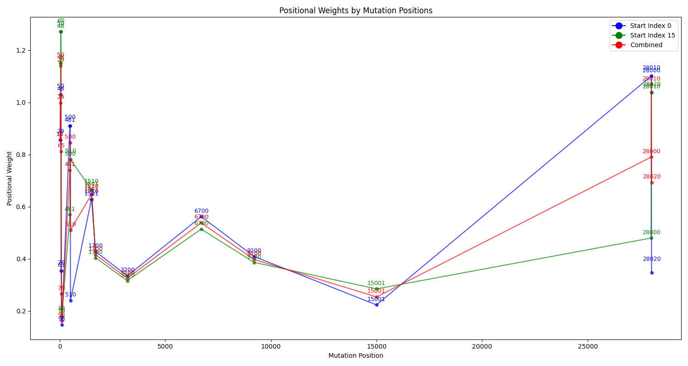
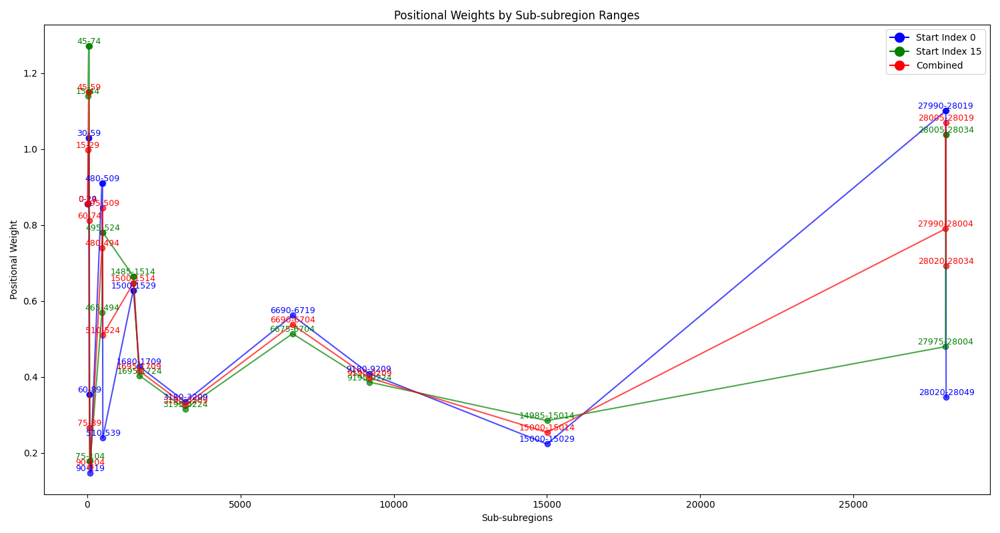
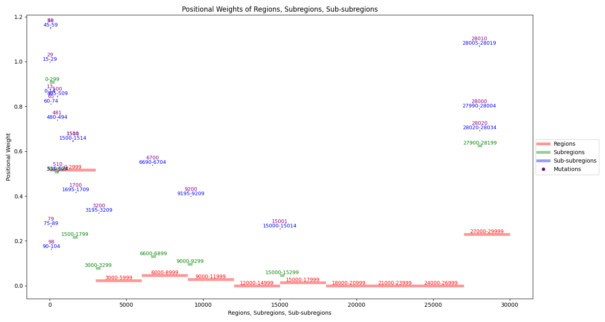

# CEMPI: Contextual Encoding of Mutations Positional Impact

CEMPI is a repository for implementing a set of algorithms that perform contextual encoding of mutations and their positional impact in a sequence.

## Project Description

CEMPI algorithm integrates partitioning and clustering methods to capture mutation positions (bases and regions) and their impact across DNA/RNA/protein sequence. The repository serves as a toolkit for bioinformaticians and researchers.

## Directory Structure

- `src`: Contains source code files.
- `mutations_data.csv`: Sample CSV file containing mutation data.

## mutations_data.csv

This file contains sample mutation data with the following columns:
- `mut_positions` (integer): Mutation positions in the sequence.
- `impact_score` (float or integer): Impact score of the mutations.

You should replace the data in this file with your own mutation data before running the analysis.

## CEMPI_result

This directory contains the output results from the algorithm. The following files are generated:
- `positional_weights_0.csv`: Contains mapped mutations and calculated positional weights data for sub-subregions generated from sequence partitioned starting at index 0.
- `positional_weights_15.csv`: Contains mapped mutations and calculated positional weights data for sub-subregions generated from sequence partitioned starting at index 15.
- `combined_data.csv`: Contains combined data from both sets of partitioned sub-subregions.
- `region_details.csv`: Contains detailed information about regions, subregions, and sub-subregions.
- `region_weights.csv`: Contains the range and weight for each region.

## Plots

The following plots are generated and saved in the `CEMPI_result` directory:

1. **Density Plot for Positional Weights**
   - Description: This plot shows the density of positional weights across different sub-subregions.
   - 

2. **Positional Weights by Mutation Positions**
   - Description: This scatter plot displays the positional weights by mutation positions for sub-subregions starting at index 0, index 15, and the combined data.
   - 

3. **Positional Weights by Sub-subregion Ranges**
   - Description: This plot shows the positional weights for sub-subregion ranges, with lines connecting the weights for sub-subregions starting at index 0, index 15, and the combined data.
   - 


4. **Positional Weights of Regions, Subregions, Sub-subregions**
   - Description: This plot shows the positional weights across regions, subregions, and sub-subregions, with interval bars indicating the range and weight for each category.
   - 

## System Requirements

- macOS 10.15 or higher / Windows 10 or higher / Linux
- Python 3.9 or higher
- pip3 24
- *May work with similar versions.

## Installation Instructions

1. Clone the repository:
   ```bash
   git clone https://github.com/raeufroushangar/CEMPI.git
   cd CEMPI

2. Install required packages:
   ```bash
   pip install -r requirements.txt

3. Run analysis script:
   ```bash
   python3 cempi_main.py -l <sequence_length> --plot

   note: Replace <sequence_length> with the length of your sequence. For example:
   python3 cempi_main.py -l 30000 

   To generate plots, include the --plot flag:
   python3 cempi_main.py -l 30000 --plot

4. To see the help message for the script:
   ```bash
   python3 cempi_main.py -h
