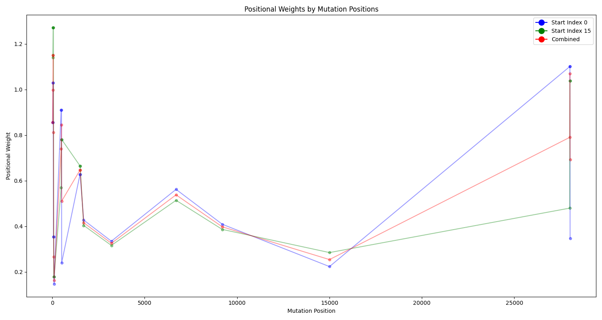

# ECMPIA: Encoding and Clustering Mutations Positional Impact Algorithm

The ECMPIA algorithm integrates partitioning and clustering methods to capture and analyze the positional impact of mutations (bases and regions) across DNA/RNA/protein sequences. It is designed to help researchers identify highly mutated bases and regions, assess their impact based on their positions, and uncover the relationships between mutations in terms of positional impact.

## Project Description

The ECMPIA repository serves as a toolkit for bioinformaticians and researchers to implement the ECMPIA algorithm for analyzing mutation impacts.

## Directory Structure

- `src`: Contains source code files.
- `mutations_data.csv`: Sample CSV file with mutation data.

## mutations_data.csv

This file contains sample mutation data with the following columns:
- `mut_positions` (integer): Mutation positions in the sequence.
- `impact_score` (float or integer): Impact score associated with mutations.

Replace the data in this file with your own mutation data before running the analysis.


## ECMPIA_result

This directory contains the output results from the algorithm. The following files are generated:
- `positional_weights_0.csv`: Mapped mutations and calculated positional weights for sub-subregions partitioned starting at index 0.
- `positional_weights_15.csv`: Mapped mutations and calculated positional weights for sub-subregions partitioned starting at index 15.
- `combined_data.csv`: Combined data from both sets of partitioned sub-subregions.
- `region_details.csv`: Detailed information about regions, subregions, and sub-subregions.
- `region_weights.csv`: Range and weight for each region.


## Plots

The following plots are generated and saved in the `ECMPIA_result` directory:

1. **Density Plot of Positional Weights**
   - Description: This plot shows the density of positional weights across sub-subregions partitioned starting at index 0, index 15, and the combined data.
   - 

2. **Scatter Plot of Positional Weights by Mutation Positions**
   - Description: This plot shows the positional weights by mutation positions for sub-subregions partitioned starting at index 0, index 15, and the combined data.
   - 

3. **Line Plot of Positional Weights by Sub-subregion Ranges**
   - Description: This plot shows the positional weights for sub-subregion ranges, with lines connecting the weights for sub-subregions partitioned starting at index 0, index 15, and the combined data.
   - 

4. **Bar Plot of Positional Weights Across Regions, Subregions, and Sub-subregions**
   - Description: This plot shows the positional weights across regions, subregions, and sub-subregions, with interval bars indicating the range and weight for each category.
   - 


## System Requirements

- macOS 10.15 or higher / Windows 10 or higher / Linux
- Python 3.9 or higher
- pip3 24
- *May work with similar versions.

## Installation Instructions

1. Clone the repository:
   ```bash
   git clone https://github.com/raeufroushangar/ECMPIA.git
   cd ECMPIA

2. Install required packages:
   ```bash
   pip install -r requirements.txt

3. Run analysis script:
   ```bash
   python3 ecmpia_main.py -l <sequence_length> --plot

   note: Replace <sequence_length> with the length of your sequence. For example:
   python3 ecmpia_main.py -l 30000 

   To generate plots, include the --plot flag:
   python3 ecmpia_main.py -l 30000 --plot

4. To see the help message for the script:
   ```bash
   python3 ecmpia_main.py -h
